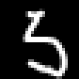
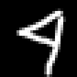
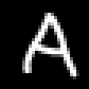

# An Image Classification Model Featuring Explainability by Image Morphing

|        Input        | Predicted Label |     Explanation     |
|:-------------------:|:---------------:|:-------------------:|
|  | 5               |  |
|  | 9               |  |
|  | 4               |  |

They explain that the input image can be read as the predicted digit.
For example, we can understand that the second input '4' can also be read as '9'.
By these explanations, we can consent to the model predictions.
